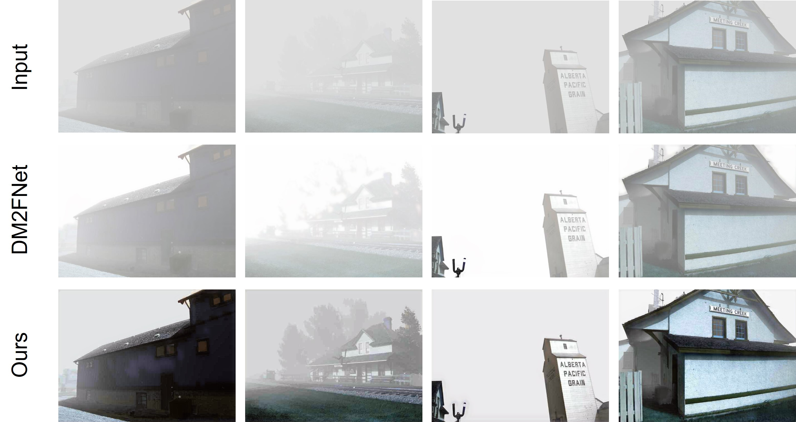

# DM2F-Enhancing
Final Dehazing Project of Digital Image Processing (COMP130032): 
    Improvemnt of [DM2F-Net](https://github.com/zijundeng/DM2F-Net).

<div style="text-align:center">
    
</div>

## Installation
1. Clone our repository
```
git clone https://github.com/lijayuTnT/Digital-Image-Process-Project-of-Fudan.git

cd improve_model
```

2. Make conda environment
```
conda create -n DMPNet python=3.8
conda activate DMPNet
```
```
pip install -r requirements.txt
```

## Data Preparation
- [HazeRD](https://labsites.rochester.edu/gsharma/research/computer-vision/hazerd/)
- [OHaze](https://data.vision.ee.ethz.ch/cvl/ntire18//o-haze/)

Please put them in the `data` directory.

## Model_Weight
Download pretrained model from __Baidu WangPan__:

https://pan.baidu.com/s/15SG_cOjG_Y8wqL5dqCyi8g?pwd=4qy6 提取码：4qy6 

and place them in the `data` directory.

## Training
```
python train.py --ckpt-path ckpt_path
```
Before training , assume that pretrained model has been put in the `ckpt_path` directory.

```
python train_ohaze.py --ckpt-path ckpt_path
```

## Evaluation
Before testing, assume that pretrained model has been put in the `ckpts` directory.

```
python test.py
```

## Contact
If you have any question or suggestion, contact me at 21307130229@m.fudan.edu.cn
