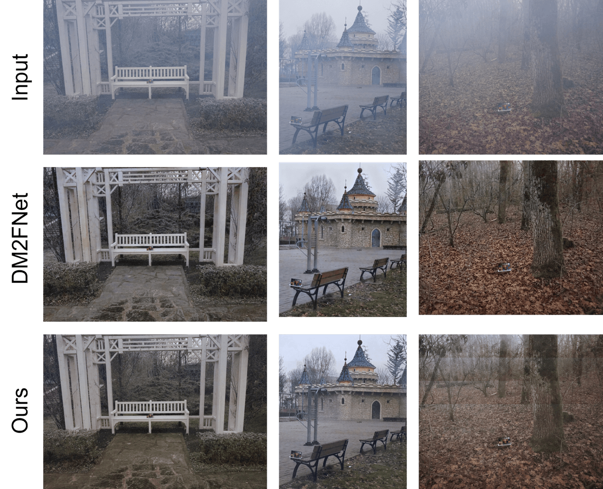

# Improved Deep Multi-Model Fusion for Physics-aware Single-Image Dehazing
# 黎佳宇 21307130229

## Abstract

Baseline中用于单图像去雾的深度多模型融合，通过预测大气散射模型以及四个雾层分离模型的无雾结果，然后将结果融合在一起以生成最终的无雾图像，采用清晰图像（又称地面实况）作为正样本1，通过基于L1/L2的图像重建损失来指导去雾网络的训练，而没有使用任何正则化，考虑到不适定的性质，对比正则化已经被开发用于单图像去雾，引入负图像的信息作为下界。此外，对于雾化过程的物理原理，多模型融合的深度去雾模型的可解释性还没有得到充分探索。在本文中，我们根据大气散射模型构建了物理感知的双分支单元。通过该单元以及对比正则化，我们建立了去雾网络，名为DMPNet。通过实验表明，DMPNet 相比Baseline有较大的提升，在 O-Haze 和 HazeRD 数据集上，PSNR 分别提高了2dB和0.5dB，尤其在HazeRD上有较大提升，同时还对自己选取的五张照片进行了去雾处理。代码可在https://github.com/lijayuTnT/Digital-Image-Process-Project-of-Fudan.git获取。Baseline和改进权重可以在 __百度网盘__ https://pan.baidu.com/s/15SG_cOjG_Y8wqL5dqCyi8g?pwd=4qy6 提取码：4qy6  中获取

## 1.Introduction
雾度是导致物体外观和对比度视觉质量明显下降的重要因素。 在模糊场景下捕获的图像会显着影响高级计算机视觉任务的性能，例如对象检测和场景理解。因此，图像去雾已成为图像恢复领域的大量研究重点，以帮助开发有效的计算机视觉系统

人们提出了各种基于 CNN 的端到端方法，通过去雾网络直接学习模糊到清晰的图像转换来简化去雾问题。然而，存在以下几个问题：（1）仅正向去雾目标函数效果较差。大多数现有方法通常采用清晰图像（又名地面实况）作为正样本1，通过基于L1/L2的图像重建损失来指导去雾网络的训练，没有使用任何正则化。然而，仅图像重建损失无法有效处理图像的细节，这可能导致恢复图像的颜色失真（见图1）。


此前提出的基于正样本的正则化以使去雾模型生成更自然的恢复图像。例如,Hong等人[1]。引入了一个额外的教师网络，将知识从教师提取的正图像的中间表示转移到学生/去雾网络，作为基于正样本的正则化。虽然他们利用正图像的信息作为上限，但由于负图像的未利用信息作为下限，伪影或不满意的结果仍然会发生。

为了解决这些问题，我使用了一种新颖的对比正则化（CR）[2]，其灵感来自对比学习。如图3右图所示，我们将有雾图像、其由去雾网络生成的相应恢复图像及其清晰图像（即地面实况）分别表示为负值、锚点和正值。有两种“对立的力量”；一种使预测更接近清晰图像，另一种使预测远离表示空间中的模糊图像。因此，CR通过对比学习将anchor图像限制在封闭的上下界内，这更好地帮助去雾网络逼近正图像并远离负图像。

由雾霾引起的图像质量下降通常是由大气散射 (AS) 模型计算[3,4]：

<math xmlns="http://www.w3.org/1998/Math/MathML" display="block"><mi>I</mi><mo stretchy="false">(</mo><mi>p</mi><mo stretchy="false">)</mo><mo>=</mo><mi>J</mi><mo stretchy="false">(</mo><mi>p</mi><mo stretchy="false">)</mo><mo>×</mo><mi>T</mi><mo stretchy="false">(</mo><mi>p</mi><mo stretchy="false">)</mo><mo>+</mo><mi>A</mi><mo stretchy="false">(</mo><mi>p</mi><mo stretchy="false">)</mo><mo>×</mo><mo stretchy="false">(</mo><mn>1</mn><mo>−</mo><mi>T</mi><mo stretchy="false">(</mo><mi>p</mi><mo stretchy="false">)</mo><mo stretchy="false">)</mo></math>

其中 I 是观察到的模糊图像； p是像素位置； J为待恢复的底层场景亮度图像； T 是传输图，它表示影响到达相机传感器的光比例的距离相关因素； A为全局大气光，表示环境光强度。

对于去雾模型的可解释性，是本次报告所感兴趣的另一个方面，大多数模型在原始空间中利用大气散射模型，而没有充分探索有益的特征级信息。为了提高模型可解释性， 我借鉴了Zheng等人的物理感知双分支单元（PDU）。 PDU在双分支中近似大气光和传输图对应的特征，分别考虑每个因素的物理特性。因此，可以根据物理模型更精确地合成潜在清晰图像的特征。最后我通过对比正则话和物理感知双分支单元来优化Baseline的多模型融合。

## 2.Related Work
### 2.1 Single Image Haze Removal

图像去雾旨在从有雾的观察图像生成无雾图像，可分为基于先验的方法和基于学习的方法。

####  2.1.1 传统算法

__基于先验的图像去雾方法__。这些方法依赖于物理散射模型[3]，通常使用经验观察中的手工先验去除雾霾，例如对比度最大化[4]、暗通道先验（DCP）[5]。虽然这些基于先验的方法取得了可喜的结果，但先验依赖于相对假设和特定的目标场景，这在复杂的实际场景中的鲁棒性较差。例如，DCP [5] 不能很好地对天空区域进行去雾，因为它不满足先验假设。

__基于学习的图像去雾方法__ 。与基于先验的方法不同，基于学习的方法是数据驱动的，通常使用深度神经网络来估计物理散射模型中的传输图和大气光或直接学习有雾图像到清晰的图像转变。

早期的工作专注于直接估计传输图和大气光。然而，这些方法可能会导致累积误差产生伪影，因为传输图和全局大气光上的不准确估计或某些估计偏差会导致恢复图像与清晰图像之间存在较大的重建误差。此外，在现实世界中收集有关传输图和全球大气光的地面实况是困难或昂贵的。

最近提出的各种端到端方法来直接学习模糊到清晰的图像转换，而不使用大气散射模型。其中大多数[6,7]专注于加强去雾网络，并采用清晰的图像作为正样本，通过图像重建损失来指导去雾网络，而不对图像或特征进行任何正则化。

__对比学习__ 。对比学习广泛应用于自监督表示学习，其中对比损失受到噪声对比估计、三元组损失或N对损失的启发。对于给定的锚点，对比学习的目的是将锚点拉近表示空间中的正点，并将锚点远离表示空间中的负点。以前的作品 [8] 经常将对比学习应用于高级视觉任务，因为这些任务本质上适合对正样本/特征之间的对比度进行建模。然而，将对比学习应用于图像去雾的工作仍然很少，因为该任务的特点是构建对比样本和对比损失。

#### 2.1.2 Baseline 算法
图2显示了Baseline的网络架构（表示为DM2F-Net），它融合了大气散射 (AS) 和层分离模型以进行除雾。给定输入模糊图像，使用注意力特征集成模块（AFIM），通过学习注意力图来生成特征图（表示为 AMLIF），以利用不同 CNN 特征之间的互补信息。然后，通过联合学习从 AMLIF 预测基于 AS 模型的结果（表示为 J0）。此外，Baseline模型还计算了来自另外四个 AMLIF 的四层分离配方的四个去雾结果（表示为J1、J2 、J3和J4）。最后，Baseline通过学习注意力图来对所有这些去雾结果进行加权，以生成最终结果。


<center> figuer2 </center>

其中注意力特征集成模块(AFIM)的架构如图三：


## 3.改进算法
本次实验对于Baseline的改进，我们的目标有两个：1）提高去雾特征空间的可解释性；2）使用对比样本建立更简洁的解决方案空间。图四说明了我的DMPNet的详细结构。为了实现我们的第一个目标，我们设计了一个源自大气散射模型的物理感知双分支单元。关于我们的第二个目标，我使用正负样本来定制对比正则化。


<center> Figure 4 </center>

### 3.1 PDU
大气散射模型通常用于描述有雾图像 I 的形成。数学上可以将其表示为:
<math xmlns="http://www.w3.org/1998/Math/MathML" display="block"><mi>I</mi><mo stretchy="false">(</mo><mi>p</mi><mo stretchy="false">)</mo><mo>=</mo><mi>J</mi><mo stretchy="false">(</mo><mi>p</mi><mo stretchy="false">)</mo><mo>×</mo><mi>T</mi><mo stretchy="false">(</mo><mi>p</mi><mo stretchy="false">)</mo><mo>+</mo><mi>A</mi><mo stretchy="false">(</mo><mi>p</mi><mo stretchy="false">)</mo><mo>×</mo><mo stretchy="false">(</mo><mn>1</mn><mo>−</mo><mi>T</mi><mo stretchy="false">(</mo><mi>p</mi><mo stretchy="false">)</mo><mo stretchy="false">)</mo></math>
其中 `J` 表示清晰图像，`T`是透射图，`A`表示大气光，`x`表示像素索引。由于 `T `和` A `都是未知的，因此去雾是一个高度不适定的问题。基于原始空间的方法直接估计两个未知因素，这很容易导致累积误差。相比之下，在特征空间中强加物理先验可​​以鼓励与欺骗过程相一致的可解释性，而不依赖于`T`和 `A` 的基本事实，我使用的一个物理感知的双分支单元（`PDU`）[9],是从特征空间中的物理模型导出的，如图5所示。首先，我们重新制定物理模型来表示清晰图像`J`，如下所示:

<math xmlns="http://www.w3.org/1998/Math/MathML" display="block"><mi>J</mi><mo stretchy="false">(</mo><mi>x</mi><mo stretchy="false">)</mo><mo>=</mo><mi>I</mi><mo stretchy="false">(</mo><mi>x</mi><mo stretchy="false">)</mo><mfrac><mn>1</mn><mrow><mi>T</mi><mo stretchy="false">(</mo><mi>x</mi><mo stretchy="false">)</mo></mrow></mfrac><mo>+</mo><mi>A</mi><mo stretchy="false">(</mo><mn>1</mn><mo>−</mo><mfrac><mn>1</mn><mrow><mi>T</mi><mo stretchy="false">(</mo><mi>x</mi><mo stretchy="false">)</mo></mrow></mfrac><mo stretchy="false">)</mo><mo>=</mo><mi>I</mi><mo stretchy="false">(</mo><mi>x</mi><mo stretchy="false">)</mo><mfrac><mn>1</mn><mrow><mi>T</mi><mo stretchy="false">(</mo><mi>x</mi><mo stretchy="false">)</mo></mrow></mfrac><mo>+</mo><mi>A</mi><mo>−</mo><mi>A</mi><mfrac><mn>1</mn><mrow><mi>T</mi><mo stretchy="false">(</mo><mi>x</mi><mo stretchy="false">)</mo></mrow></mfrac><mo stretchy="false">(</mo><mn>1</mn><mo stretchy="false">)</mo></math>

然后通过内核 k 提取特征，方程:(1) 可以重新表述如下:

<math xmlns="http://www.w3.org/1998/Math/MathML" display="block"><mi>k</mi><mo>∗</mo><mi>J</mi><mo>=</mo><mi>k</mi><mo>∗</mo><mo stretchy="false">(</mo><mi>I</mi><mo>⊙</mo><mfrac><mn>1</mn><mi>T</mi></mfrac><mo stretchy="false">)</mo><mo>+</mo><mi>k</mi><mo>∗</mo><mi>A</mi><mo>−</mo><mi>k</mi><mo>∗</mo><mo stretchy="false">(</mo><mi>A</mi><mo>⊙</mo><mfrac><mn>1</mn><mi>T</mi></mfrac><mrow></mrow><mo stretchy="false">)</mo><mo>,</mo><mo stretchy="false">(</mo><mn>2</mn><mo stretchy="false">)</mo></math>

记D = 1/T的矩阵。改写为矩阵形式后，公式变为：

<math xmlns="http://www.w3.org/1998/Math/MathML" display="block"><mi>K</mi><mi>J</mi><mo>=</mo><mi>K</mi><mi>D</mi><mi>I</mi><mo>+</mo><mi>K</mi><mi>A</mi><mo>−</mo><mi>K</mi><mi>D</mi><mi>A</mi><mo>.</mo><mo stretchy="false">(</mo><mn>3</mn><mo stretchy="false">)</mo></math>

接下来，我们可以将矩阵 KD 分解为两个矩阵 QK 的乘积。因为K、D 和 Q 都是未知的，实现这种分解可以表示为求解欠定方程组，从而可以保证 Q 的存在。从而可以得到等式：

<math xmlns="http://www.w3.org/1998/Math/MathML" display="block"><mi>K</mi><mi>J</mi><mo>=</mo><mi>Q</mi><mo stretchy="false">(</mo><mi>K</mi><mi>I</mi><mo stretchy="false">)</mo><mo>+</mo><mi>K</mi><mi>A</mi><mo>−</mo><mi>Q</mi><mo stretchy="false">(</mo><mi>K</mi><mi>A</mi><mo stretchy="false">)</mo><mo>.</mo><mo stretchy="false">(</mo><mn>4</mn><mo stretchy="false">)</mo></math>

我们可以将A'表示为对应于大气光的特征 KA 的近似值，将 ̃t'表示为与传输图相关的Q的近似值。此外，KI和KJ可以分别视为有雾图像及其对应的清晰图像的提取特征。基于等式。 (4)，并假设特征t'的通道数与输入特征M的通道数相同，可以通过如下公式计算受物理感知的特征J：

<math xmlns="http://www.w3.org/1998/Math/MathML" display="block"><mi>J</mi><mo>=</mo><mi>M</mi><mo>⊙</mo><msup><mi>t</mi><mo>′</mo></msup><mo>+</mo><msup><mi>A</mi><mo>′</mo></msup><mo>−</mo><msup><mi>A</mi><mo>′</mo></msup><mo>⊙</mo><msup><mi>t</mi><mo>′</mo></msup><mo>=</mo><mi>M</mi><mo>⊙</mo><msup><mi>t</mi><mo>′</mo></msup><mo>+</mo><msup><mi>A</mi><mo>′</mo></msup><mo stretchy="false">(</mo><mn>1</mn><mo>−</mo><msup><mi>t</mi><mo>′</mo></msup><mo stretchy="false">)</mo><mo>,</mo></math>

A' 的计算公式如下：
<math xmlns="http://www.w3.org/1998/Math/MathML" display="block"><mi>A</mi><mo>=</mo><mi>H</mi><mo stretchy="false">(</mo><mrow><mo>σ</mo></mrow><mo stretchy="false">(</mo><mi>C</mi><mi>o</mi><mi>n</mi><mi>v</mi><mi>N</mi><mo stretchy="false">(</mo><mi>R</mi><mi>e</mi><mi>L</mi><mi>U</mi><mo stretchy="false">(</mo><mi>C</mi><mi>o</mi><mi>n</mi><mi>v</mi><mi>N</mi><mn>8</mn><mo stretchy="false">(</mo><mi>G</mi><mi>A</mi><mi>P</mi><mo stretchy="false">(</mo><mi>M</mi><mo stretchy="false">)</mo><mo stretchy="false">)</mo><mo stretchy="false">)</mo><mo stretchy="false">)</mo><mo stretchy="false">)</mo><mo stretchy="false">)</mo></math>


t'的计算公式如下：

<math xmlns="http://www.w3.org/1998/Math/MathML" display="block"><mi>t</mi><mo>=</mo><mrow><mo>σ</mo></mrow><mo stretchy="false">(</mo><mi>C</mi><mi>o</mi><mi>n</mi><mi>v</mi><mi>N</mi><mo stretchy="false">(</mo><mi>R</mi><mi>e</mi><mi>L</mi><mi>U</mi><mo stretchy="false">(</mo><mi>C</mi><mi>o</mi><mi>n</mi><mi>v</mi><mi>N</mi><mn>8</mn><mo stretchy="false">(</mo><mi>C</mi><mi>o</mi><mi>n</mi><mi>v</mi><mi>N</mi><mo stretchy="false">(</mo><mi>M</mi><mo stretchy="false">)</mo><mo stretchy="false">)</mo><mo stretchy="false">)</mo><mo stretchy="false">)</mo><mo stretchy="false">)</mo><mo>.</mo></math>

最终我使用的PDU的架构如图5显示：


<center> Figure5 </center>

### 3.2对比正则化
受对比学习 [15,32,21,16,7]的启发，它的目标是学习一种表示，以在某些度量空间中拉出“正”对，并推开“负”对之间的表示。我使用了对比正则化（CR）来生成更好的恢复图像。因此，CR中需要考虑两个方面：一是构造“正”对和“负”对，二是找到这些对的潜在特征空间进行对比。在CR中，正对和负对分别由清晰图像J及其通过DMPNet去雾网络恢复的图像J'组成的组以及 J'和模糊图像I组成的组生成。对于潜在特征空间，我们从相同的固定预训练模型 G 中选择公共中间特征，例如VGG-19 [43]。

最后优化模型的Loss可表示为：

<math xmlns="http://www.w3.org/1998/Math/MathML" display="block"><mi>l</mi><mi>o</mi><mi>s</mi><mi>s</mi><mo>=</mo><mi>l</mi><mi>o</mi><mi>s</mi><msub><mi>s</mi><mrow><mi>L</mi><mn>1</mn></mrow></msub><mo>+</mo><mi>l</mi><mi>o</mi><mi>s</mi><msub><mi>s</mi><mrow><mi>C</mi><mi>R</mi></mrow></msub></math>

## 4.Experiment
我将我的去雾网络DMPNet与Baseline DM2FNet在数据集HazeRD和O-Haze以及自己搜集的五张照片上进行比较。此外，我们采用三个广泛使用的指标进行定量比较，它们是峰值信噪比（PSNR）[41]、结构相似性指数（SSIM）[32]和CIEDE2000[39],以及MSE (Mean Square Error)。我的代码、经过训练的模型和基准数据集的去雾结果可在 https://github.com/lijayuTnT/Digital-Image-Process-Project-of-Fudan 上公开获取。 

### 4.1. Results on Real-world Images

__HazeRD__ 
超参设置设置为
```python
cfgs = {
    'use_physical': True,
    'iter_num': 40000,
    'train_batch_size': 1,
    'last_iter': 0  ,
    'lr': 5e-4,
    'lr_decay': 0.9,
    'weight_decay': 0,
    'momentum': 0.9,
    'w_loss_l1':1,        // L1loss权重
    'w_loss_vgg7' : 0.1, //CRloss权重
    'cl_lambda' :0.25,
    'snapshot': '',
    'val_freq': 1000,
    'crop_size': 256,
    'blocks' :19, //PDU个数
}
```

HazeRD的原始数据仅由十张图片组成，其gt和hazy由函数生成，函数中能见度的设置会影响图片中雾的浓度，所以只能保证Baseline和改进版本使用的是同一组数据而不一定和论文相同，依据Baseline论文,在RESIZE的ITS数据集上进行训练，其中DM2FNet训练了40000个epochs，DMPNet训练了20000个epochs，在HazeRD进行测试，DMPNet和Baseline在各项指标上的表现如下：

|指标类型|PSNR|SSIM|CIEDE2000|MSE||
|:-|:-|:-|:-|:-|:-|
|Baseline|12.333|0.699|0.436|0.094||
|DMPNet|14.327|0.73|0.311|0.048||

可以看到DMPNet在各项指标上都优于Baseline，在实际的感官感觉上亦是如此。选取了两组照片进行比较如下，其中第二组是浓雾情况下的表现：


__O-Haze__

超参设置为
```
cfgs = {
    'use_physical': True,
    'iter_num': 20000,
    'train_batch_size': 4,
    'last_iter': 0,
    'lr': 2e-4,
    'lr_decay': 0.9,
    'weight_decay': 2e-5,
    'momentum': 0.9,
    'w_loss_l1':1,
    'w_loss_vgg7' : 0.1,
    'snapshot': '',
    'val_freq': 1000,
    'crop_size': 512,
    'blocks' : 19,
}
```

使用DMPNet和DM2FNet在NTIRE 2018 outdoor dehazing challenge (O-HAZE).上进行测试,其中DMPNet和DM2FNet均训练了20000个epochs，它们的各项指标如下表：

|指标类型|PSNR|SSIM|CIEDE2000|MSE||
|:-|:-|:-|:-|:-|:-|
|Baseline|24.449|0.767|0.004|0.089||
|DMPNet|23.203|0.781|0.006|0.088||

DMPNet在OHaze上的表现可能和DM2FNet差不多，观察测试集输出图片发现有一张图片的结果明显偏低，为psnr=19.0964(如图第三组)，剔除掉这张图片后DMPNet的效果还是略好于DM2FNet(0.5左右)，其中的一组对比如下：



__My_picture__

我选择使用在O-Haze上训练的模型对我的照片进行去雾，输入输出如下：


### 4.2 消融实验

从Baseline出发，逐步加入PDU和CR，在HazeRD数据集上得到的消融实验结果表如下:

|PDU|CR|PSNR⬆|SSIM⬆|CIEDE2000⬇|MSE⬇|
|:-|:-|:-|:-|:-|:-|
|||12.333|0.699|0.436|0.094|
|√||14.211|0.703|0.392|0.046|
|√|√|14.327|0.73|0.311|0.052|


__缺陷__ 

在处理一些图像时还是会出现虚影的现象。例如：


这可能和训练集的大小有关，因为我在HazeRD上没有观察到这样的现象，而ITS的数据集是远大于OHaze的，也就是说，DMPNet在大数据量的情况下表现更好。


### 4.3时间复杂度分析

由于DM2FNet的特征提取使用的是预训练的resnext模型，而DMPNet使用的是含有PDU的模块进行训练的，模型的其余架构均一致，使用二者的时间复杂度均是O(n*c*h*w)，其中n是批处理数，c是通道数，h是图片高，w是图片宽，实际训练上，DMPNet的耗时比DM2FNet要多一倍左右，这是因为特征提取层需要训练的缘故。__在ITS上使用一张RTX3090跑一次Baseline需要两个半小时，跑一次DM2FNet需要四个小时小时.__


## 5.Conclusion
在本文中，我构造了一种用于单图像去雾的新型模型DMPNet。使用了正负对比样本进行对比正则化。为了增强特征空间的可解释性，我进一步使用了基于物理模型的物理感知双分支单元。该单元产生的特征被强制符合雾化过程，从而有利于雾化去除。大量的实验证明了该方法的有效性和通用性。

## 6.Reference

[1] Alexander Hermans, Lucas Beyer, and Bastian Leibe. In defense of the triplet loss for person re-identification. arXiv preprint arXiv:1703.07737, 2017. 3

[2]Haiyan Wu, Yanyun Qu, Shaohui Lin, Jian Zhou, Ruizhi Qiao, Zhizhong Zhang, Yuan Xie, Lizhuang Ma; Proceedings of the IEEE/CVF Conference on Computer Vision and Pattern Recognition (CVPR), 2021, pp. 10551-10560

[3] Earl J McCartney. Optics of the atmosphere: scattering by molecules and particles. nyjw, 1976. 2

[4] Robby T. Tan. Visibility in bad weather from a single image. In CVPR, 2008. 2

[5] Kaiming He, Jian Sun, and Xiaoou Tang. Single image haze removal using dark channel prior. TPAMI, 33(12):23412353, 2010. 2, 3, 6, 

[6] Wenqi Ren, Lin Ma, Jiawei Zhang, Jinshan Pan, Xiaochun Cao, Wei Liu, and Ming-Hsuan Yang. Gated fusion network for single image dehazing. In CVPR, pages 3253–3261, 2018. 3

[7] Xiaohong Liu, Yongrui Ma, Zhihao Shi, and Jun Chen. Griddehazenet: Attention-based multi-scale network for image dehazing. In ICCV, 2019. 1, 2, 3, 4, 5, 6, 7, 8

[8] Kaiming He, Haoqi Fan, Yuxin Wu, Saining Xie, and Ross Girshick. Momentum contrast for unsupervised visual representation learning. In CVPR, pages 9729–9738, 2020. 2,

[9] Zheng Y, Zhan J, He S, et al. Curricular contrastive regularization for physics-aware single image dehazing[C]//Proceedings of the IEEE/CVF conference on computer vision and pattern recognition. 2023: 5785-5794.